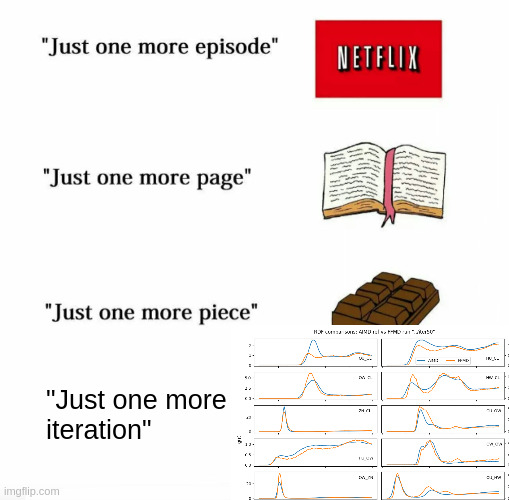
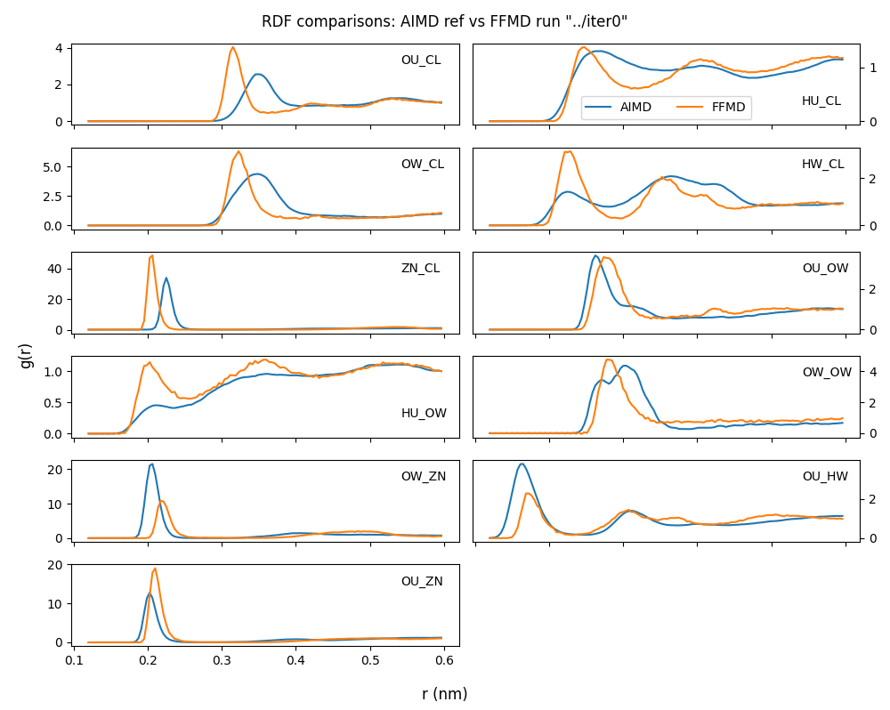
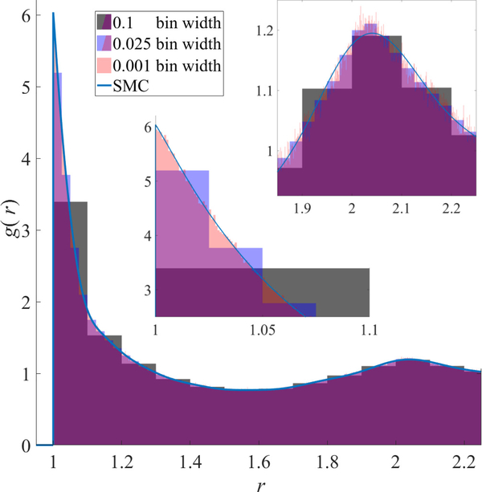
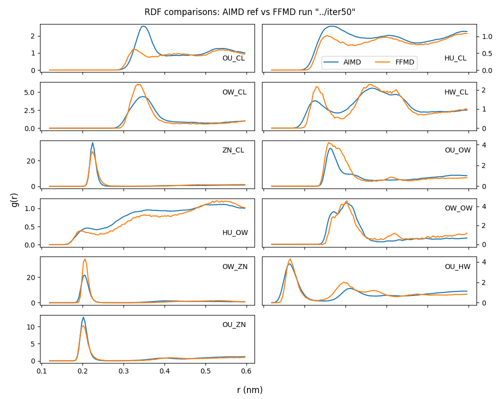

## In A Nutshell

:::: {.columns}

::: {.column width="50%"}

- Vibe code a bunch of Python

- Run MD with force field parameters

- Get _energy finite differences_ per frame with LAMMPS `rerun`

- Get _RDF discrepancies_ per frame using _spectral Monte Carlo_

- _Decorrelate_ ("whiten") both inputs, then _cross-correlate_ to get the residual gradients

- _Predict_ a new better FF parameter set!

:::

::: {.column width="50%"}



:::

::::

## The Target: Aqueous Zn²⁺ System

| Component | Atom Types | Starting FF |
|-----------|-----------|-----------|
| Zn²⁺ ion | Zn | [@Dubou_Dijon_2017] |
| Cl⁻ ion | Cl | [@Loche_2021] |
| Urea | HU, OU, NU, CU | [@Anker_2023] |
| Water | HW, OW | [@Fuentes_Azcatl_2014] |

- 8 unique atom types → **36 pair RDFs** theoretically possible
- Ions + organic co-solvent = complex environment
- We tune parameters so simulated RDFs match AIMD reference data

## The Starting Point



## Iterative FF Improvements:

::: {.center}
**A → B → C → A → B → C → ...**
:::

| Phase | What | Wall-Time Cost |
|-------|------|:---:|
| **A. MD Simulation** | Run NVT with current FF parameters | ~1 hr (2 ns) |
| **B. Finite Differences** | Rerun trajectory with ±0.5% perturbations | 1-2 mins |
| **C. Optimisation** | Build Jacobian, take Levenberg-Marquardt step | 1-2 mins |

But why??


## Finite-Difference: Motivation and Method

We want to know how the expected value of an observable $O$ will change if we change some parameter $\lambda$. By stat mech:

$$ -\frac{1}{\beta} \frac{\mathrm{d} \langle O \rangle }{\mathrm{d} \lambda} = \left \langle O  \frac{\mathrm{d} U}{\mathrm{d} \lambda} \right \rangle -  \langle O \rangle \langle \frac{\mathrm{d} U}{\mathrm{d} \lambda} \rangle $$

where $U$ is the potential energy. Approach used in _ForceBalance_ [@Wang_2014] [@Wade_2018]

In LAMMPS: for each tuneable parameter *λ*

1. Rescale *λ* by **0.995** and **1.005**
2. Re-run the **identical** trajectory (`rerun nvt_prod.xtc`)
3. Compute energy at every frame for each rescaling
4. Form the finite-difference derivative:

$$
\frac{\partial U}{\partial \lambda} \approx
\frac{U(1.005\lambda) - U(0.995\lambda)}{0.01\lambda}
$$


## 17 Tuneable Parameters

::: {.small}
| Category | Variables | Count |
|----------|-----------|:---:|
| Cl LJ | `epsCl`, `sigCl` | 2 |
| Zn LJ | `epsZn`, `sigZn`, `sZnCl` | 3 |
| Urea LJ | `epsHU`, `sigHU`, `epsOU`, `sigOU`, `epsNU`, `sigNU`, `epsCU`, `sigCU` | 8 |
| Charges | `qZn`, `qHU`, `qOU`, `qHW` | 4 |
:::

- `eps*` = LJ ε (kcal/mol), `sig*` = LJ σ (Å)
- `sZnCl` = cross-pair sigma (overrides mixing rule)
- `q*` = partial charge (|e|)
- Cross-pair LJ between unlike types computed via Lorentz-Berthelot mixing

## Spectral Monte Carlo RDF

Evaluate RDF with _spectral Monte Carlo_ on a _functional basis set_ [@Patrone_2017]:

$$ g(r) = \sum a_j \phi_j(r); a_j = \frac{V}{N_A N_B} \sum_{\mathrm{pairs}} \frac{\phi(j) r_{\mathrm{pair}}}{4 \pi r_\mathrm{pair}^2} $$

Represent g(r) on `[r_min, r_max]` as a discrete cosine series 

$$
g(r) \approx \sum_{k=0}^{N-1} c_k \cos\!\left(k \cdot
\frac{\pi(r - r_\text{min})}{r_\text{max} - r_\text{min}}\right)
$$

| Aspect | Histogram | Cosine Coefficients |
|--------|:---------:|:-------------------:|
| Dimension | 100–200 bins | **128 modes** |
| Smoothness | Noisy per-frame | Inherently smooth |
| Correlation | High | Lower |

Straightforwardly: _n_ particles into _k_ modes = _O(n k)_ work.

But cos basis lets us use _non-uniform FFT_ [@Barnett_2019] [@Barnett_2021]: _O(n + k ln k)_ work.

Can also reuse existing Python functions (`scipy.fft.dct`) for inter-conversion.

## Example



## Per-Pair PCA

For each atom pair (e.g., Zn–OU, Cl–HW), the trajectory of cosine coefficients is `(nframes, 128)`.

- **Covariance PCA**: Diagonalise the 128×128 mode covariance matrix
- Keep top `nvecs` (5–10) components — typically captures 80–95% of variance
- Project both **simulation trajectory** and **reference RDF** into PCA space

::: {.center}
`128 modes` → `nvecs PCA loadings` per pair
:::

Residuals = simulated PCA loadings − reference PCA loadings

## Why Per-Pair PCA?

| Factor | Global PCA (all pairs) | Per-Pair PCA |
|--------|:---:|:---:|
| Physical meaning | Mixes unrelated chemistry | Pure per-pair fluctuations |
| Variance capture | One size fits none | Optimal per pair |
| Weighting | Hard to balance pairs | Pair-specific via eigenvalues |

**Why it matters:** Zn–Cl ion pairing fluctuates very differently from OW–HW water structure. Each pair has its own dominant modes. Combining them would wash out chemically meaningful signals.

- PCA weights (`√eigenvalue/Σeigenvalues`) automatically down-weight noisy high-order modes
- This means the optimiser **focuses on physically meaningful variations**, not noise

## Further Decorrelations

After PCA, we have a large, structured residual vector **r** (length = npair × nvecs).

**Problem 1:** Energy derivatives ∂E/∂λ for different parameters are correlated
— changing ε_Zn and ε_Cl both affect the same Zn–Cl RDF.

**Problem 2:** PCA residuals _across_ different pairs are correlated
— a fluctuation in Zn–OU also affects Zn–OW through shared Zn motions.

::: {.center}
**Solution: Whiten twice.**
:::

---

## Whitening Step 1: Finite Differences

```
Findif matrix: (nframes × 17 parameters)

Cov(findifs) → eigendecomposition → Mahalanobis whitening

J' = L_fd⁻¹ · J     (decorrelated across parameters)
```

- Uses **OAS shrinkage** for robust covariance estimation [@Chen_2010]
- Result: each parameter's sensitivity is statistically independent

---

## Whitening Step 2: Residual Covariance

```
Per-frame PCA residuals: (nframes × nrows)

Cov(residuals) → OAS shrinkage → Mahalanobis whitening

J_w = L_res⁻¹ · J'     (decorrelated across residual dimensions)
r_w = L_res⁻¹ · r'
w = 1 (uniform — data is now uncorrelated)
```

**Why double whitening:** The LM algorithm assumes uncorrelated, equal-variance residuals. Whitening transforms correlated data into canonical form so standard LM works optimally. Double whitening also produces a **well-conditioned Hessian** `J_wᵀJ_w` ≈ I.

## End-to-End Data Flow

```
                ┌─────────────────┐
Trajectory      │  NUFFT per pair │    128 cosine modes
nvt_prod.xtcu──▶│  Frame-by-frame │───▶ per frame & pair
                └─────────────────┘
                                               │
                ┌─────────────────┐            ▼
 findif.txt ───▶│  Mahalanobis    │     ┌──────────┐
  (∂E/∂λ per    │  whitening      │     │ Per-pair │
   frame)       └─────────────────┘     │   PCA    │
                       │                └──────────┘
                       ▼                     │
                    J_pca ◀──────────────────┘
                       │          (nrows × nvars)
                       ▼
                 ┌─────────────────┐
                 │  Cov(ε_frames)  │     Mahalanobis whitening
                 │  OAS shrinkage  │───▶ on residual space
                 └─────────────────┘
                       │
                       ▼
                 J_w, r_w, w=1
                       │
                       ▼
                 ┌─────────────────┐
                 │  LM Optimiser   │     λ-adaptive, hard-clipped
                 │  (trust-region) │───▶ ff.var{N+1}
                 └─────────────────┘
```


## Levenberg-Marquardt (LM) Step

Standard LM with trust-region regularization:

$$
(J_w^T J_w + \lambda \cdot \text{diag}(J_w^T J_w) + R_{ii})
\cdot \delta = -J_w^T r_w
$$

$$
R_{ii} = \frac{\text{reg_strength}}
{(\text{max_frac} \cdot |p_i|)^2}
$$

Also calculate $\rho$: actual residual drop / predicted (bigger = better!)

| Feature | Purpose |
|---------|---------|
| λ (adaptive) | Interpolates between Gauss-Newton (small $\lambda$) and gradient descent (large $\lambda$) |
| R_diag (per-param) | Prevents blowup when `p_i` is small |
| Hard clip (±25%) | Prevents any single parameter from jumping too far |
| ρ-based λ tuning | ρ > 0.75 → more Gauss-Newton; ρ < 0.25 → more gradient descent |

## Results: ~50 Iterations of Automated Refinement

- 52 parameter files (`ff.var0` through `ff.var51`)
- 51 RDF comparison plots (ref vs. sim at each iteration)
- No human intervention between iterations — fully automated SLURM job

## How It Started ...


## ... How It's Going



## This Slide Is Why You Should Never Let An AI Write Your Slides

| Traditional | This Work |
|-------------|-----------|
| Weeks/months of expert tweaking | **Hours of automated iteration** |
| Fit a handful of parameters | **17 parameters simultaneously** |
| Manually judge RDF quality | **Quantitative cost function** |
| One simulation per guess | **Rerun = instant "what-if"** |
| Hard to extend to new systems | **Generic: swap ref data, run** |

## References

::: {#refs}
:::

## Questions? {.center}

# Bonus Slides

## Code Structure

```
PCA2-zn-des/
├── mar/                  # Python analysis & optimisation
│   ├── step_ww_rw.py     # ★ Main workflow (WW optimiser)
│   ├── cosrdf.py         # Cosine-coefficient RDF container (HDF5)
│   ├── trajectory.py     # NUFFT cosine coefficient computation
│   ├── optimizer.py      # Levenberg-Marquardt solver
│   ├── ff_params.py      # LAMMPS FF parameter resolution
│   ├── histrdf.py        # Alternative histogram-based RDF
│   └── prepare_ref.py    # Import AIMD reference RDFs
├── scripts/              # LAMMPS inputs & batch scripts
│   ├── in.nvt            # NVT MD simulation
│   ├── in.findif         # Finite-difference energy computation
│   ├── ff.var{N}         # Variable FF params per iteration
│   ├── findif.sh         # Post-process findif output
│   └── iter.sh           # SLURM batch: iterations 31–50
└── iter{N}/              # Per-iteration outputs
```

## DCT vs. NUFFT

There are two cosine representations used:

| Method | Use | How |
|--------|-----|-----|
| **DCT type-1** | Reference RDFs, reconstruction | `scipy.fft.dct` on uniform grid |
| **NUFFT type-1** | Raw trajectory frames | `finufft` on non-uniform distances |

**Why NUFFT for frames:** pair distances are not on a grid — they're scattered points. NUFFT computes exact cosine coefficients without binning or interpolation errors.

Boundary scaling conventions:

- Forward: `c₀ /= √2`, `c_{N-1} *= 2`
- Inverse: `c₀ *= √2`, `c_{N-1} /= 2`

## PCA Algorithm

```python
def PCA(data, dims=2):
    data_mean = data.mean(axis=0)
    data_c   = data - data_mean
    R = np.cov(data_c, rowvar=False)      # (nmode, nmode)
    evals, evecs = scipy.linalg.eigh(R)
    idx = np.argsort(evals)[::-1]          # largest first
    evecs = evecs[:, idx][:, :dims]        # top dims
    evals = evals[idx]
    frame_loadings = evecs.T @ data_c.T    # project frames
    return data_mean, evecs, frame_loadings.T, evals
```

Target projection:

```python
target_loadings = evecs.T @ (target_ref - series_mean)
```

Jacobian via per-frame covariance:

```python
jac[idx*nvecs : (idx+1)*nvecs] = (frame_resids.T @ findifs) / nframes
```

## Per-Pair Details

::: {.center .small}
| Pair | xmin (nm) | xmax (nm) | Chemistry |
|------|-----------|-----------|-----------|
| Zn_Cl | ~0.12 | ~0.60 | Ion pairing |
| Zn_OU | ~0.12 | ~0.60 | Zn–urea oxygen |
| Zn_OW | ~0.12 | ~0.60 | Zn–water oxygen |
| OU_HW | ~0.12 | ~0.60 | Urea O – water H |
| HW_OW | ~0.12 | ~0.60 | Water structure |
:::

- Each pair has its own spherical prefactor normalisation
- Self-pairs (i=j) get factor of 2
- Loop ordering groups pairs for FastNS box reuse (by descending pair count)

## Parameter Downweighting

The pipeline supports selective pair-type weighting:

```bash
--downweight OU 2.0    # upweight urea-oxygen pairs
--downweight ZN 0.5    # downweight zinc-containing pairs
```

**Why this matters:** Some RDFs are better constrained by AIMD than others, or more important for the target chemistry. This lets the optimiser focus effort where it matters.

## LM Implementation Details

Key constants from `optimizer.py`:

```python
LAM_INIT_FACTOR  = 1e-6   # λ₀ = 1e-6 × max(diag(H), 1)
LAM_INCREASE     = 2.0    # double λ when ρ < 0.25
LAM_DECREASE     = 0.5    # halve λ when ρ > 0.75
MAX_LAM_ADJUST   = 20     # max inner-loop adjustments
HARD_CLIP_FRAC   = 0.05   # default 5% (iter.sh uses 25%)
RHO_GOOD = 0.75, RHO_BAD = 0.25
```

ρ (gain ratio):

$$
\rho = \frac{\text{cost}_\text{old} - \text{cost}_\text{new}}
{\text{predicted reduction}}
$$

- ρ ≈ 1 → model is accurate → decrease λ (trust the quadratic model)
- ρ ≈ 0 → model is poor → increase λ (move toward gradient descent)
- λ is persisted across iterations in `lm_state.txt`

## Why OAS Shrinkage?

Oracle Approximating Shrinkage provides a well-conditioned regularized covariance estimate:

$$
\Sigma_\text{OAS} = (1 - \rho) S + \rho \cdot \text{tr}(S)/p \cdot I
$$

where *S* is the sample covariance and *ρ* is the optimal shrinkage intensity.

**Why not raw sample covariance:** with ~120 frames estimating a ~60×60 covariance matrix, raw estimates are singular and noisy. OAS automatically finds the optimal shrinkage toward a well-conditioned diagonal target.

Diagnostics reported: shrinkage %, condition number, effective DOF.
